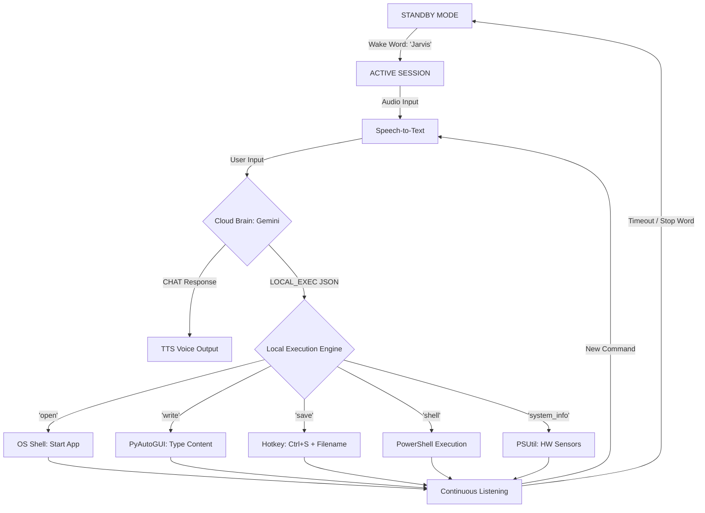

# J.A.R.V.I.S. System Manifest

## 1. Core Model Configuration
The system utilizes a **Triple-Layer Hybrid Intelligence Architecture** to ensure maximum availability and local privacy.
*   **Primary Brain:** `gemini-flash-latest` (Cloud - High speed, low latency).
*   **Secondary Brain:** `gemini-pro-latest` (Cloud - Advanced reasoning, fallback).
*   **Local Core (New):** `Ollama (llama3.2:3b)` (Offline fallback - Local execution, high privacy).
*   **Reasoning Protocol:** Hybrid Intent Recognition (Parses natural language into structured JSON actions).

## 2. Integrated Libraries & Extensions
The program is built using Python 3.x with the following specialized libraries:

| Library | Purpose |
| :--- | :--- |
| `google-genai` | Interface for the Gemini Cloud Brain. |
| `speech_recognition` | Converts your voice into text. |
| `sounddevice` & `numpy` | Real-time audio stream capturing and volume visualization. |
| `pyttsx3` | Text-to-Speech (TTS) engine for JARVIS's voice. |
| `pyautogui` | Emulates keyboard/mouse for "human-like" control (typing, saving). |
| `psutil` | System monitoring (CPU, RAM, Battery status). |
| `tkinter` | Graphical User Interface (GUI) and visualizer. |
| `python-dotenv` | Secure management of API Keys and environment variables. |

## 3. Program Architecture (Flow Chart)

## 4. Operational Logic
1.  **Continuous Listening:** Once activated, J.A.R.V.I.S. enters a persistent loop. It remains active for multiple commands so you don't have to say "Jarvis" repeatedly.
2.  **Concurrency:** The GUI and the Voice Engine run on separate threads. This ensures the visualizer stays smooth while J.A.R.V.I.S. is speaking.
3.  **JSON Protocol:** All local actions are passed as structured JSON objects, making the system highly resistant to "AI hallucinations" or incorrect command formatting.
